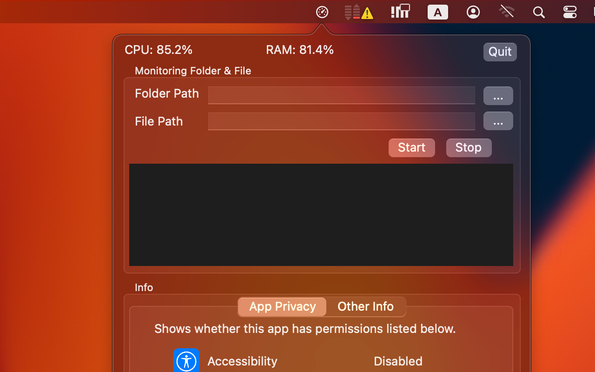
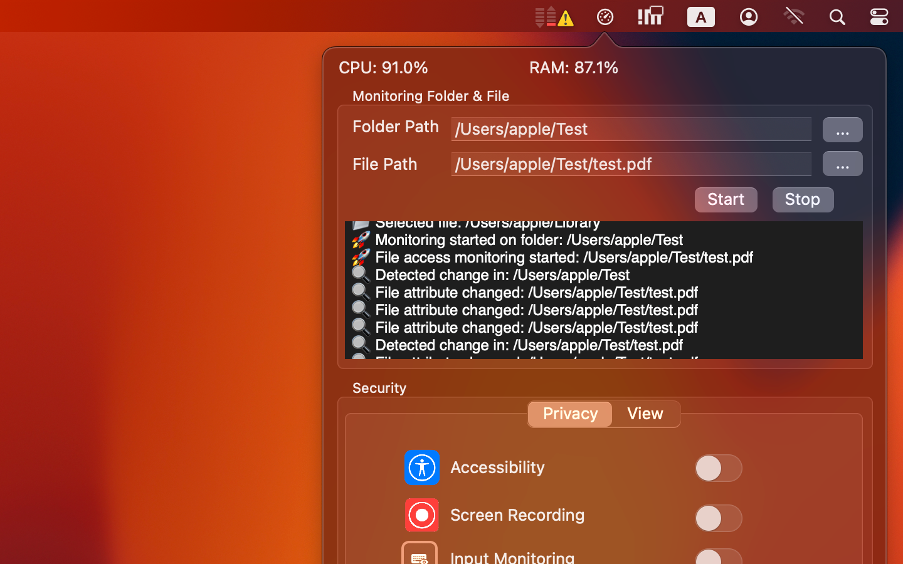
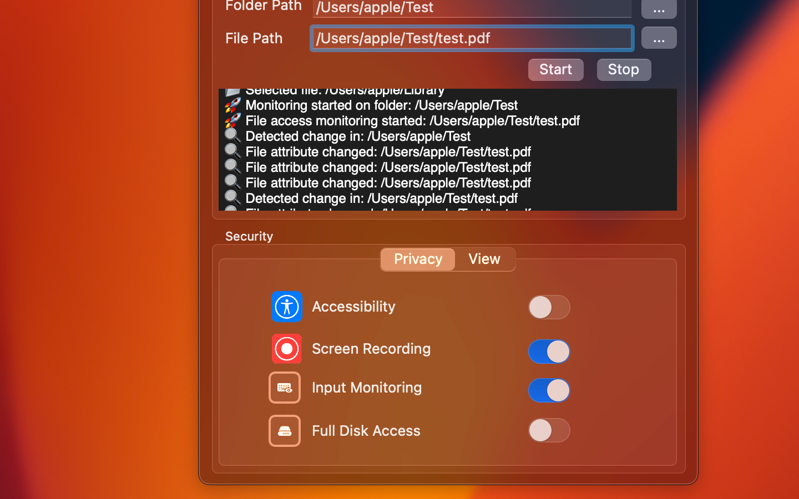

<h3>ScoutHawkLite</h3>

Controls your external display brightness and volume and shows native OSD.
Use menubar extra sliders or the keyboard, including native Apple keys!

  

 
 

 

ScoutHawkLite — macOS System Monitor & Privacy Permission Guard
ScoutHawkLite is a lightweight, efficient, and privacy-focused macOS utility that monitors CPU usage, memory consumption, file & folder changes, and the system’s Privacy & Security permission states including Accessibility, Screen Recording, Input Monitoring, and Full Disk Access.
Designed for developers, security professionals, and users who need reliable, real-time insight into their Mac’s performance and integrity.

📥 Download
* Mac App Store: Coming soon
* Latest Release (DMG): https://github.com/lavinabera/ScoutHawkLite/releases
* Official Website: https://github.com/lavinabera/

About
ScoutHawkLite provides continuous, real-time monitoring of macOS performance metrics and system permission states.Unlike traditional system monitors, this app also tracks file system activity and TCC permission changes, ensuring full visibility over important system-level events.
It is optimized for:
* macOS developers
* Security and compliance environments
* IT administrators
* Power users who want deeper insight into system activity

Major Features

🔧 System Resource Monitoring
* Real-time CPU usage
* Real-time RAM usage
* Minimal resource consumption
* Clean, menu-bar-based UI

📁 File & Folder Change Monitoring
Track changes in selected directories and files, including:
* Creation
* Deletion
* Renaming
* Modification
Ideal for monitoring project directories, configuration files, logs, system folders, etc.

🛡 macOS Privacy & Security Permission Monitoring
Instant detection and status tracking of:
* Accessibility
* Screen Recording
* Input Monitoring
* Full Disk Access
You are notified immediately when system permission states change.

🖥 Menu Bar UI
* Quick system overview at a glance
* Interactive dropdown panel
* Light & Dark Mode supported
* Designed for Retina and high-resolution displays

📣 Event Notifications
* Folder and file change alerts
* Permission change notifications
* Optional resource usage threshold alerts

🧪 macOS Compatibility
macOS Version	Support
macOS 15 Sequoia	✔ Fully supported
macOS 14 Sonoma		✔
macOS 13 Ventura	✔
macOS 12 Monterey	✔
macOS 11 Big Sur	✔
Universal Binary — supports both Intel and Apple Silicon.

🖼 Supported Displays
* macOS menu bar
* Popup/dropdown panels
* Dark mode
* Retina displays
* External monitors (including ultrawide displays)

🔒 Privacy Policy
ScoutHawkLite does not collect, store, or transmit ANY personal data.
* All monitoring occurs locally on your device
* No analytics, no cloud services, no servers
* The app never uploads or shares folders, files, or permission data
* No network connections of any kind
This app is suitable for use in secure environments such as research labs, corporate devices, and offline systems.

📚 Documentation
Getting Started
* Install the app from the App Store or via DMG
* Grant system permissions upon first launch
* Add folders or files to the monitoring list
* Customize menu bar display options
Troubleshooting
* Permission states are not updating
* File change events are not being detected
* CPU or RAM values not appearing
* How to reset the app’s configuration

🧱 Technology Stack
* Language: Swift
* Frameworks:
    * AppKit / SwiftUI
    * File System Events (FSEvents)
    * macOS TCC Permission APIs
    * Dispatch & system statistics APIs
* Architecture:
    * Menu-bar status application (NSStatusItem)
    * Multi-threaded background event listeners
    * Observer/event-driven design

📸 Screenshots

🚀 Roadmap
* iCloud sync for settings (optional)
* More detailed system graphs
* Background logging history
* Customizable notification rules
* Export/backup configuration file

❓ FAQ
Q: Does this app collect usage data?A: No. Everything stays on your Mac. The app has zero networking functions.
Q: Why does the app require Accessibility or Screen Recording?A: Only to check the status of permissions—never to record or access data.
Q: Will this affect system performance?A: No. The app is optimized for minimal CPU and RAM usage.

🤝 Contributing
Pull requests, feature suggestions, and issue reports are welcome.

📬 Contact
* Developer: Quynh Trang Hoang Thi
* Email: lavinaberatw5z1@gmail.com
* Website: https://github.com/lavinabera/

📄 License
This project is available under the MIT License or your chosen commercial license.

